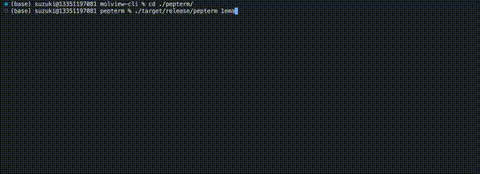

# pepterm

View protein structures in your terminal with beautiful color gradients.



## Features

- Fetch proteins directly from RCSB PDB (e.g., `pepterm 1CRN`)
- Search RCSB PDB database (e.g., `pepterm search insulin`)
- Support for PDB and CIF file formats
- Chain selection (e.g., `pepterm 4HHB --chain A`)
- High-quality cartoon representation via PyMOL
- 13 built-in color schemes (rainbow, blues, greens, viridis, plasma, etc.)
- Interactive mouse controls for rotation, zoom, and pan
- Braille and block character rendering modes

## Installation

### From crates.io

```sh
cargo install pepterm
```

### From Source

```sh
git clone https://github.com/suzuki-2001/pepterm.git
cd pepterm
cargo build --release
./target/release/pepterm 1CRN
```

### Requirements

PyMOL is required for cartoon rendering:

```sh
# macOS
brew install pymol

# Linux (Ubuntu/Debian)
sudo apt install pymol
```

## Usage

```
pepterm <PDB_ID>                   Fetch and view protein from RCSB PDB
pepterm <file.pdb|.cif>            View local PDB/CIF file
pepterm <file.obj>                 View OBJ file
pepterm <ID> --chain <CHAIN>       Show specific chain only
pepterm search <QUERY>             Search RCSB PDB
```

### Options

| Option | Description |
|--------|-------------|
| `--chain`, `-n` | Show only the specified chain (e.g., A, B) |
| `--color`, `-c` | Specify color scheme |

### Color Schemes

| Scheme | Description |
|--------|-------------|
| coolwarm | Blue to red diverging (default) |
| rainbow | N-to-C terminal rainbow |
| blues | Sequential blue gradient |
| greens | Sequential green gradient |
| reds | Sequential red gradient |
| oranges | Sequential orange gradient |
| purples | Sequential purple gradient |
| viridis | Perceptually uniform (blue-green-yellow) |
| plasma | Purple to yellow |
| magma | Black to white via purple |
| inferno | Black to yellow via red |
| spectral | Spectral rainbow |
| white | White monochrome |

### Examples

```sh
pepterm 1CRN                  # View crambin protein
pepterm 4HHB                  # View hemoglobin
pepterm 4HHB --chain A        # View only chain A of hemoglobin
pepterm 1CRN --color blues    # Use blues colormap
pepterm ./protein.pdb         # View local PDB file
pepterm ./structure.cif       # View local CIF file
pepterm search insulin        # Search for insulin structures
pepterm search "green fluorescent protein"
```

### Controls

| Key/Action | Description |
|------------|-------------|
| Mouse drag | Rotate around the model (disables auto-rotate) |
| Shift + drag | Pan the view |
| Scroll up/down | Zoom in/out |
| r | Toggle auto-rotation |
| c | Cycle through color schemes |
| 0 | Reset view |
| q or Ctrl+C | Quit |

## How It Works

1. For PDB IDs: Fetches structure from RCSB PDB, generates cartoon via PyMOL
2. For PDB/CIF files: Loads local file, generates cartoon via PyMOL
3. For OBJ files: Directly renders the 3D model
4. For search: Queries RCSB PDB REST API and displays results

PyMOL provides high-quality cartoon representation with proper helix spirals and sheet arrows.

## Acknowledgments

This project is based on [terminal3d](https://github.com/liam-ilan/terminal3d) by Liam Ilan, a terminal-based 3D OBJ viewer. The rendering engine, camera system, and braille/block character output are derived from terminal3d.

## License

MIT
